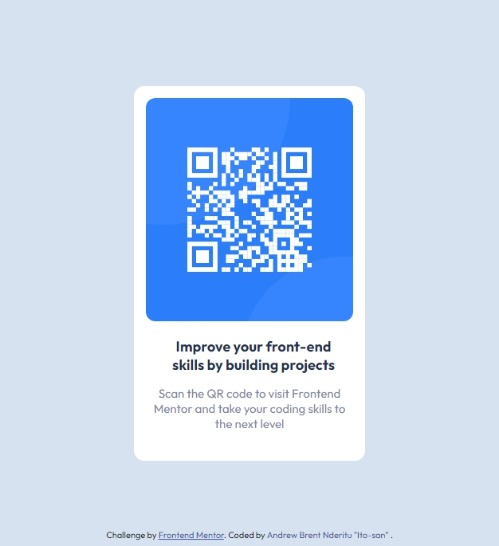
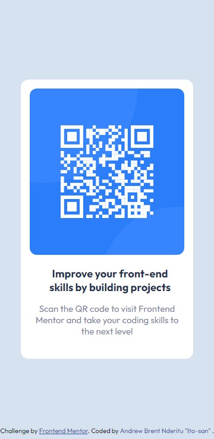

# Frontend Mentor - QR code component solution

This is a solution to the [QR code component challenge on Frontend Mentor](https://www.frontendmentor.io/challenges/qr-code-component-iux_sIO_H). Frontend Mentor challenges help you improve your coding skills by building realistic projects. 

## Table of contents

- [Frontend Mentor - QR code component solution](#frontend-mentor---qr-code-component-solution)
  - [Table of contents](#table-of-contents)
  - [Overview](#overview)
    - [Screenshots](#screenshots)
    - [Links](#links)
  - [My process](#my-process)
    - [Built with](#built-with)
    - [What I learned](#what-i-learned)
    - [Continued development](#continued-development)
    - [Useful resources](#useful-resources)
  - [Author](#author)
  - [Acknowledgments](#acknowledgments)

**Note: Delete this note and update the table of contents based on what sections you keep.**

## Overview

Hello world! I'm Andrew Nderitu " Ito-san". As an aspiring Computer Science student, my passion for web development led me to embark on a journey to enhance my frontend skills. 
The challenge entails creating a visually appealing webpage featuring a QR code provided by Frontend Mentor. The challenge is to craft a website that closely resembles the provided design while adhering to the prescribed guidelines. This project serves as an ideal entry point for newcomers(newbies - HTML and CSS), offering an excellent platform to sharpen my web development skills and gain hands-on experience in a guided and supportive environment. By replicating the given design and following the provided instructions,I can storm through the web development journey with enthusiasm and confidence, honing my abilities and building a foundation for future endeavors.

### Screenshots

()

### Links

- Solution URL: [Add solution URL here](https://your-solution-url.com)
- Live Site URL: [Add live site URL here](https://your-live-site-url.com)

## My process
😑👈
- Applied reverse engineering to break down the webpage into components.
- Identified each component and created pseudocode for the HTML to simplify the process.
- Utilized paint to determine specific div heights and widths, following straightforward instructions for design.
- CSS proved challenging, but with guidance from my friend Elvis👈 and support from ChatGPT, I successfully navigated through it.
- Embraced a harmonious blend of human expertise, my struggle and AI assistance, resulting in a captivating project that fueled my passion for continuous learning and growth in web development.
- I acknowledge the fact that using chatGTP or any other AI language is not the best practise of learning, but in this case chatGTP proved that it can also be a mentor in learning as not all questions I could raise to Elvis as this would be stubborn and irritating. Although there is a discord or slack community in frontend mentor, I'm and introvert so AI real saved on this one. But in the future I would really like to start showing off my skills and acknowledging others people solutions.

### Built with

- Semantic HTML5 markup
- CSS custom properties

### What I learned

In this exciting journey, I've discovered that CSS can be a real time-sucker in web design. To tackle it head-on, I'm determined to master the CSS basics, a game-changer for future UI/UX aspirations.

But guess what? I found a genius shortcut to speed up my HTML game! Emmet shorthand syntax rocks! 😏💪🔥
Just check out this snappy code: `.parent>.attributes+main>div.QR+div.text`.

And you know what's the real secret sauce? Believe in yourself 😎 and do your research right. No fluff, just pure confidence and grit. That's how I've leveled up as a web developer, and there's no stopping me now. Ready to dive into new challenges with boldness!

### Continued development

I want to sharpen my CSS skills and improve some tricks in HTML so as to make the design seamless.
Also I will embark on Javascript journey to master JS and make website more interactive and beautiful.
Learn UI/UX for future website - aesthetic webpages. 

### Useful resources

- [Google fonts](https://fonts.google.com/) - This helped me in importing the fonts, but also taught me that there's no need to go through the hustle and bustle of trying to get a font the I desire, because it's already made😁 
- Well Elvis had to be here coz he really helped my along the way, hopefully in the future I will not need him or AI and infact I'll be the one guiding others.

## Author

- Website - [Add your name here](https://www.your-site.com)
- Frontend Mentor - [@Brent001Ito-san](https://www.frontendmentor.io/profile/Brent001Ito-san)
- Twitter - [@Ito_sanBren](https://twitter.com/Ito_sanBrent?t=t8BEn5TTVnQ0AwrGrKfq1Q&s=08)

## Acknowledgments

I really wanna acknowledge my mentor Elvis🤝, he is the one who told me about Frontend mentor and now I've got this feeling of keep working on web development.

-----

We're done for now 🚀
